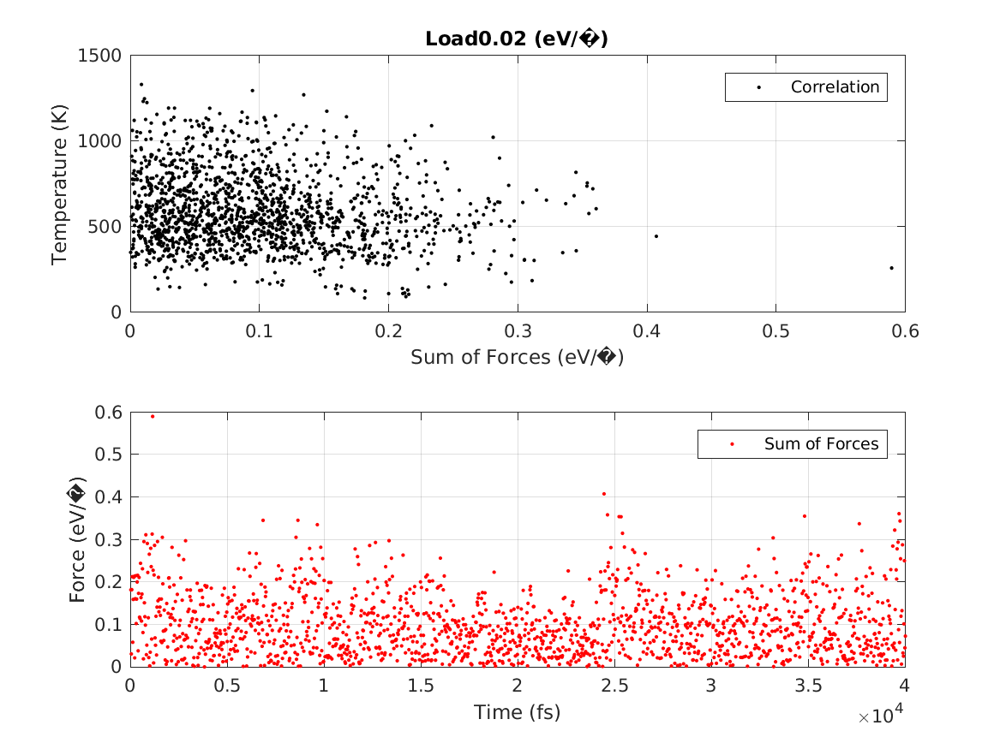
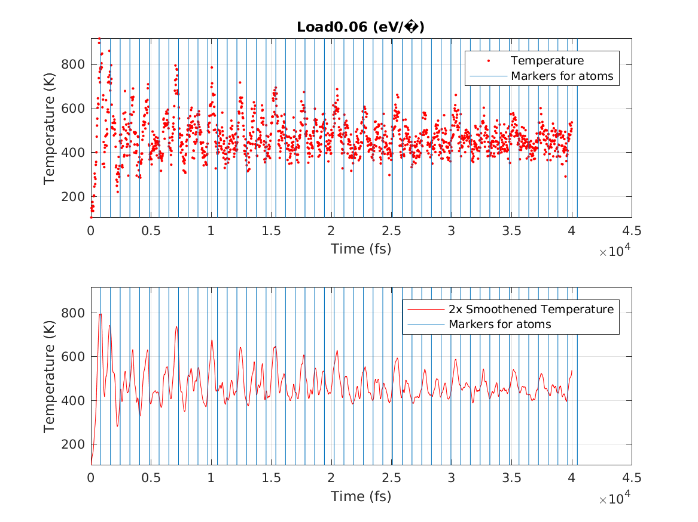
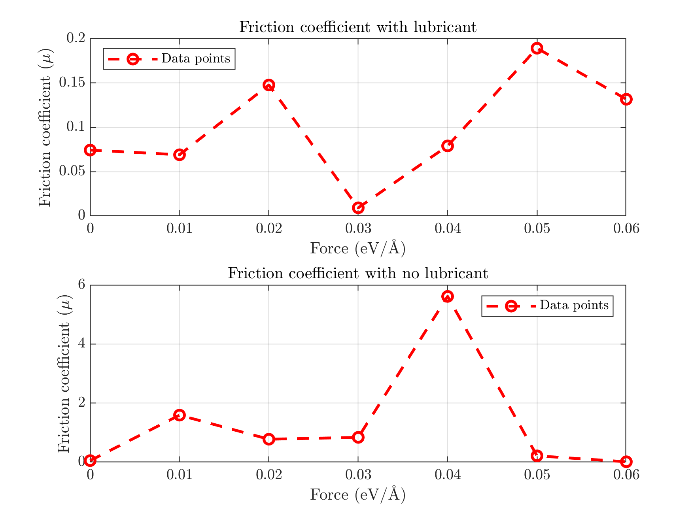

# Friction-simulation
Course project for simulating friction on an atomic scale with solid FCC-structure layers and liquid lubrication.

## Prerequisites
* Python 2.7.2
* [ASE](https://wiki.fysik.dtu.dk/ase/)
* [NumPy](http://numpy.scipy.org/)
* [Pysic](http://thynnine.github.com/pysic/)
* [friction_tools](https://users.aalto.fi/~asf/teaching/aalto_physics/tools.html)

## Installation
* [Instructions are here](https://users.aalto.fi/~asf/teaching/aalto_physics/)

## Images

## Special thanks
* Coffee machine of Aalto University Guild of Physics
